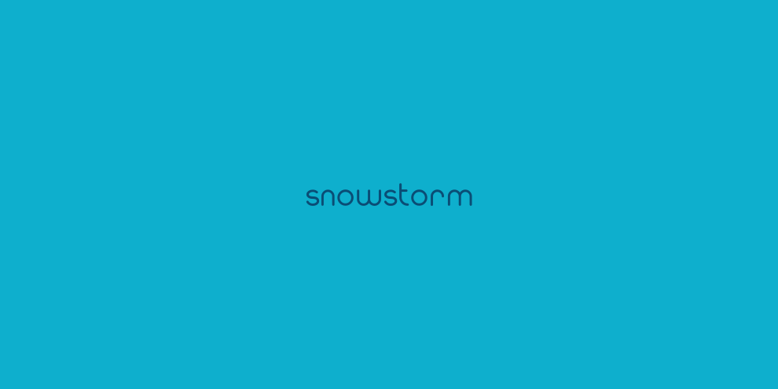

<!-- markdownlint-disable-file MD033 -->
<!-- markdownlint-disable-file MD036 -->
<!-- markdownlint-disable-file MD041 -->


[](https://github.com/ShaidK/Snowstorm/actions/workflows/snowstorm_cd_workflows.yaml)

**INSTALLATION**

The "Snowstorm Project" is a clean & elegant [Visual Studio Code Theme][1] designed
to match a minimalistic Blue & White Colour Palettes. To install the "Snowstorm
Theme" within [Visual Studio Code][1] you will need to search for "Snowstorm
Theme" within the [Extension Menu][2].  

Alternatively, you can install the Extension by using the [VSIX File][3] by running
the following command (_Replace the "X.X.X" with the current [Release Version][4]_):

```powershell
code --install-extension snowstorm-color-theme-X.X.X.vsix
```

**BUILD PROJECT**

Before you can build the "Snowstorm Project" locally you will need to install
"[NodeJS][7]". This is required as the "Snowstorm Project" uses "[npm][8]" to
Build, Lint & Package the Project.

The "Snowstorm Project" is configured with a "[launch.json][5]" which enables
the Project to be debug locally by pressing the "F5" Key. This will open an
[Extension Host][9] which will allow you to analyse & debug the "Snowstorm
Project" locally.

**NPM SCRIPTS**

The "Snowstorm Project" consist of some "[npm][8]" scripts which are configured
within the "[package.json][10]" file. These are mainly configured to Build, Lint
& Package the "Snowstorm Project".

You can run these scripts by running the "Build Snowstorm Project" Task defined
within the "[tasks.json][6]" file. This will automate the task to build, lint &
package the Project _(See [Task][11] for more information)_.

You can further run this by running the following command:

```powershell
npm run build
```

**CONTINOUS INTEGRATION**

The "Snowstorm Project" is configure with a Continuous Integration Pipeline to
build the Project each time a Pull Request has been opened via "[Github Actions][12]".
The Pipeline itself will build & lint the Project on different variations of
"[NodeJS][7]".

Further security analysis will be conducted whereby if a security vulnerability
has been identified, it will generate a issue providing information on the
security vulnerability.

**CONTINOUS DEPLOYMENT**

Once the Pull Request is built & merge, the Continuous Deployment Pipeline will
build & deploy the "Snowstorm Project" into the "[Visual Studio Marketplace][13]".
This has been configured with the following:

- _Upload Artifact - This will upload the Package NPM [VSIX File][3] within the
  Build Pipeline_
- _Integrate Tag - This will generate a Tag based upon the current NPM Version_
- _Build Release - This will build a Release which will retain upload the
  Package NPM [VSIX File][3]_

<p align="center">
    
</p>

[1]: https://code.visualstudio.com/ "Visual Studio Code"
[2]: https://code.visualstudio.com/docs/editor/extension-marketplace "Extension Marketplace"
[3]: https://code.visualstudio.com/docs/editor/extension-marketplace#_install-from-a-vsix "VSIX File"
[4]: https://github.com/ShaidK/Snowstorm/releases "Snowstorm Project"
[5]: https://github.com/ShaidK/Snowstorm/blob/build/.vscode/launch.json "Project File"
[6]: https://github.com/ShaidK/Snowstorm/blob/build/.vscode/tasks.json "Project File"
[7]: https://nodejs.org/en/ "NodeJS"
[8]: https://www.npmjs.com/ "NPM"
[9]: https://code.visualstudio.com/api/advanced-topics/extension-host "Extension Host"
[10]: https://github.com/ShaidK/Snowstorm/blob/build/package.json "Package JSON"
[11]: https://code.visualstudio.com/Docs/editor/tasks "Task"
[12]: https://docs.github.com/en/actions "Github Actions"
[13]: https://marketplace.visualstudio.com/ "Visual Studio Marketplace"
